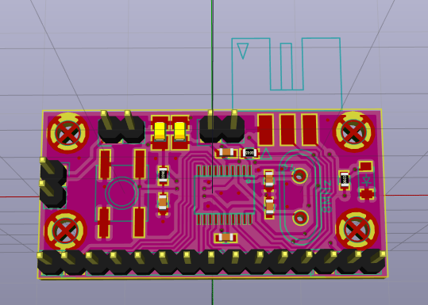
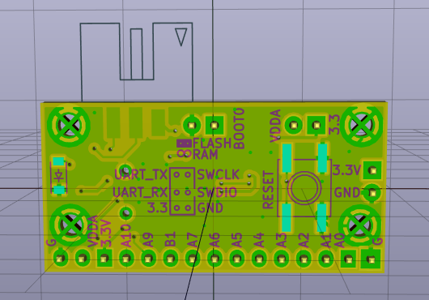

miniboard-stm32f0
=================

This is the simplest bare-minimum form of a protototyping board for the stm32f030 chip from S.T.

Here is how it looks like :

Front

The orientation of the pin headers is only indicative. 

* The long pin header row is intended to be plugged into a breadboard, back side facing up.
* Other pin headers can be soldered on either side of the board depending on the usage
* quartz is optional
* Reset button can be soldered on top or bottom side (or both)

The board is made with Kicad and requires a 2015 version (with .pretty footprints support) for editing.
